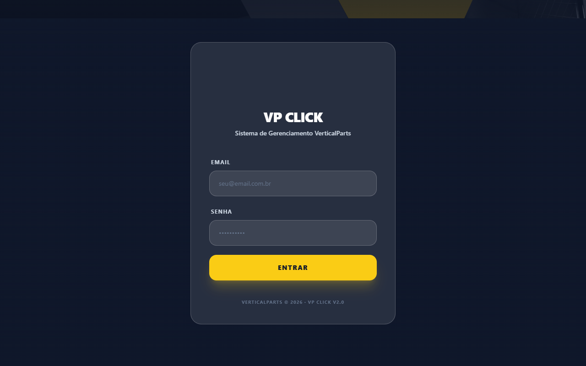
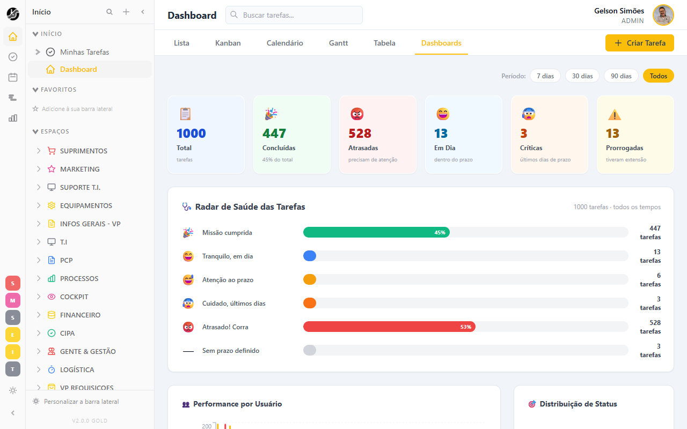

<div align="center">


# VP Click

**Sistema interno de gestão de tarefas da VerticalParts — estilo ClickUp**

[](https://reactjs.org)
[](https://typescriptlang.org)
[](https://supabase.com)
[](https://tailwindcss.com)
[](https://vpclick.vpsistema.com)

</div>

---

## Visão Geral

O **VP Click** é a plataforma de gestão de tarefas e projetos da VerticalParts — construída internamente, inspirada na interface do ClickUp. Centraliza demandas de todos os departamentos em um único lugar, com múltiplas views, automações e dashboards em tempo real.

> **Acesso:** [vpclick.vpsistema.com](https://vpclick.vpsistema.com) · Login via SSO do Portal VerticalParts

---

## Screenshots

<table>
  <tr>
    <td align="center"><strong>Tela de Login</strong></td>
    <td align="center"><strong>Dashboard Principal</strong></td>
  </tr>
  <tr>
    <td></td>
    <td></td>
  </tr>
</table>

---

## Funcionalidades

### Views de Tarefas
| View | Descrição |
|------|-----------|
| **Lista** | Visualização tabular com filtros e ordenação |
| **Kanban** | Quadro por status com drag & drop |
| **Calendário** | Distribuição de tarefas por data |
| **Gantt** | Linha do tempo com dependências |
| **Tabela** | Grade com campos customizados editáveis |
| **Dashboard** | Métricas, gráficos e radar de saúde |

### Gestão de Tarefas
- Hierarquia completa: **Workspace → Space → Folder → List → Task**
- Subtarefas aninhadas (até 7 níveis), checklists, comentários e anexos
- Log de atividades por tarefa
- Prioridades: `BAIXA` · `MÉDIA` · `ALTA` · `URGENTE`
- 17 departamentos organizados em Spaces independentes

### Colaboração
- **Equipes**: grupos de usuários atribuíveis a tarefas de uma vez (estilo ClickUp Teams)
- **Menções**: `@Pessoa` ou `@Equipe` nos comentários, com autocomplete
- **Notificações in-app**: sino em tempo real para menções e atribuições

### Campos Customizados
`DROPDOWN` · `TEXT` · `TEXTAREA` · `DATE` · `NUMBER` · `LABELS` · `CHECKBOX` · `MONEY` · `WEBSITE`

### Automações
Triggers disponíveis:
- `status_changed` · `priority_changed` · `assignee_changed` · `due_date_arrives`

Actions disponíveis:
- `change_status` · `add_assignee` · `send_notification` · `create_task`

---

## Stack Técnica

| Camada | Tecnologia |
|--------|-----------|
| Frontend | React 18 + Vite + TypeScript |
| UI | Tailwind CSS + shadcn/ui |
| Backend | Supabase (Auth + Database + Storage) |
| Deploy | Hostinger (CI/CD via branch `main`) |
| Auth | Supabase Auth + SSO via vpsistema.com |

---

## Roles & Permissões

| Role | Acesso |
|------|--------|
| `ADMIN` | Acesso total — configurações, automações, todos os spaces |
| `GESTOR` | Gerencia spaces do seu departamento, cria/atribui tarefas |
| `COLABORADOR` | Visualiza e atualiza tarefas atribuídas a si |

---

## Deploy & Infraestrutura

```
Produção:   https://vpclick.vpsistema.com
Branch:     main (deploy automático via Hostinger)
Supabase:   sfpnjwllcmentoocylow.supabase.co
VPS:        srv1510643.hstgr.cloud (Ubuntu 24.04 + Docker + Traefik)
```

---

## Rodando Localmente

```bash
# Clone o repositório
git clone https://github.com/verticalpartsIA/vp-click.git
cd vp-click

# Instale as dependências
npm install

# Configure as variáveis de ambiente
cp .env.example .env
# Edite .env com as chaves do Supabase

# Inicie o dev server
npm run dev
```

Acesse em `http://localhost:5174`

---

## Estrutura de Departamentos

O VP Click organiza as equipes da VerticalParts em 17 Spaces:

`Suprimentos` · `Marketing` · `Suporte T.I.` · `Equipamentos` · `Infos Gerais VP` · `T.I.` · `PCP` · `Processos` · `Cockpit` · `Financeiro` · `CIPA` · `Gente & Gestão` · `Logística` · `VP Requisições` · `Comercial` · `Engenharia` · `Pós-Venda`

---

## Guia Rápido para Usuários

1. **Acesse** [vpclick.vpsistema.com](https://vpclick.vpsistema.com) — você será redirecionado ao Portal VerticalParts para autenticação
2. **Navegue** pelos Spaces do seu departamento na barra lateral esquerda
3. **Escolha a view** que preferir: Lista para visão detalhada, Kanban para fluxo de trabalho
4. **Crie tarefas** com o botão `+ Criar Tarefa` ou diretamente na lista/kanban
5. **Acompanhe** seu progresso no **Dashboard** com o Radar de Saúde das Tarefas

---

<div align="center">

**VerticalParts © 2026 · VP Click v2.0**

*Desenvolvido internamente pela equipe de T.I. da VerticalParts*

</div>
